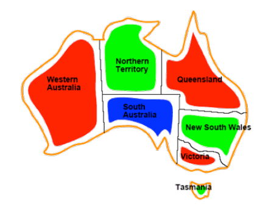
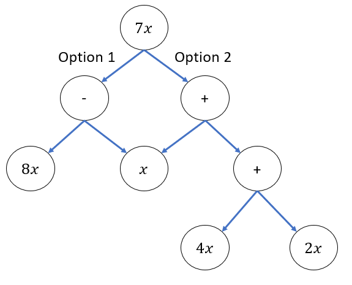
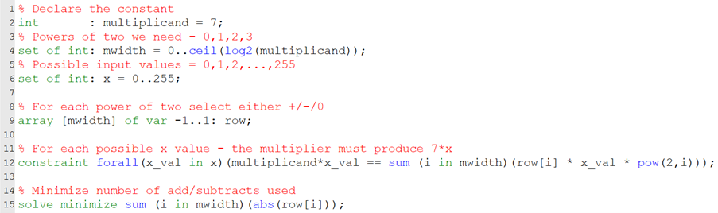
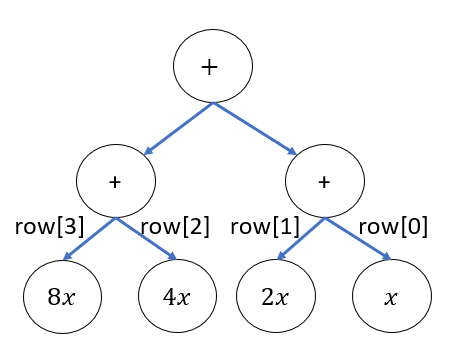

# Part 1: Hardware Design via Constraint Satisfaction, An Intro to MiniZinc!
At the [Formal Methods in Computer Aided Design](https://fmcad.org/FMCAD23/) (FMCAD) 2023 Conference, [Prof. Peter Stuckey](https://people.eng.unimelb.edu.au/pstuckey/) from Monash University in Melbourne gave a great tutorial on [MiniZinc](https://www.minizinc.org/). MiniZinc is a language that can be used to express constraint satisfaction and optimization problems in a higher-level language. This objective is similar to that of [Rosette](https://emina.github.io/rosette/) that aims to express program synthesis challenges at a higher level of abstraction. During the tutorial, Prof. Stuckey showed how MiniZinc could be used to find a hardware circuit implementing constant multiplication. This got me interested, so I started to hack. This blog post will describe my first hacking with MiniZinc and how I used it to solve some simple hardware design challenges which I often encounter at Intel.  

## Constraint Satisfaction
Constraint satisfaction is just a fancy way to describe a problem where you need to find a solution that meets a set of requirements. For example, you may be tasked with designing a circuit that computes a particular function. However, your manager has imposed constraints on the number of operations your circuit can use to perform this task to meet the performance requirements. Such a problem can be conveniently expressed in a language like MiniZinc, then passed onto an automated solver that returns a “satisfying solution”, which in this case corresponds to a feasible circuit design. We’ll see this in practice shortly.

## MiniZinc
MiniZinc is really useful for two reasons. Firstly, it acts a bit like a compiler. MiniZinc programs can be mapped onto a whole suite of different solvers, as each solver is specialized for different tasks. Secondly, being high-level, users don’t need to understand how to really use the underlying solvers, MiniZinc handles that all for you. This is ideal for people like me, who had never heard of or had any experience with constraint satisfaction solvers before. 

## Getting Started
MiniZinc is nicely packaged with its own IDE, meaning there’s no need to install a bunch of dependencies (at least on windows). Opening up the IDE we get a simple example to start from. There’s an interface that lets you select and run any of the solvers that come packaged with MiniZinc e.g. Gecode and Coin-BC. It also supports all the usual text editor features. As a starting point I copied the [map colouring](https://www.minizinc.org/doc-2.7.6/en/modelling.html) MiniZinc model (.mzn) from the tutorial in the [documentation](https://www.minizinc.org/doc-2.7.6/en/index.html). Just hitting run, the MiniZinc compiler takes over and generates a FlatZinc model (.fzn). This FlatZinc model can then be processed by the solvers which hopefully find a result. Trying this out on the Australian map colouring problem we discover that we can colour the states of Australia such that no bordering states are the same colour, using only three colours. Image credit Colorado State University [CSP Lecture Notes](https://www.cs.colostate.edu/~howe/cs440/csroo/yr2015fa/more_progress/08_csp2015.pdf). 

  

## Hardware Time: Constant Multiplication
Prof. Stuckey demonstrated how MiniZinc could be used to design a circuit constant multiplication e.g. $7x$, where $x$ is a variable input. This may seem like a trivial problem, but in low-level circuit design, we are restricted to only the following operations: addition, subtraction and multiplication by powers of two (a shift operator). This gives rise to several ways to compute $7x$.

$$7x=4x+2x+x=8x-x$$

  

The first option uses two additions whilst the second option uses only one subtraction. This is relevant because in circuit design, multiplication by a power of two can be computed for free, therefore only the add/subtract correspond to a non-zero hardware cost. As a result option two is the optimal circuit implementation.
Let’s look at my first attempt to solve this problem using MiniZinc. 

Firstly, in lines 1-4 we declare the constant multiplicand and the largest power of two we need, in this case $8(=2^3)$. We then set the range of possible values that $x$ can take in line 6. In MiniZinc terminology this corresponds to the data of the problem. Next, in line 9, we define 4 variables, $row[0],…,row[3]$, each constrained to take a value in $\{-1,0,1\}$. The objective is to find an optimal assignment for these variables. In line 12, we define a constraint:

$$\forall x\in[0,255], 7x = \sum_{i=0}^7 2^i \times x \times row[i] $$

  

Line 12 uses two of MiniZinc’s “generator expressions”, forall and sum, that allow us to concisely encode the mathematical formula above. At this point we have a fully defined problem. In line 15 we call solve and add an objective, to minimize $\sum_{i=0}^3|row[i]|$.

Hitting run in the MiniZinc IDE, we get the following output in 0.496 seconds that corresponds to $7x=8x-x$:

  

  

Solving this problem, MiniZinc provides the following factorizations for $7x$.

$$7x=8x-4x+2x+x$$
What about 99?
$$99x=128x-64x+32x+16x-8x-4x-2x+x$$
Notice that MiniZinc assigns a non-zeros coefficient to every power of two. This provokes the following question, is this always true, or more formally:
$$
\text{Given odd }k\in \mathbb{N},\text{let }n=\lceil log_2⁡k\rceil,\\
\exists y_0,y_1,…,y_{n-1}∈\{-1,1\}
\text{, such that } k =\sum_{i=0}^{n-1} 2^i\times y_i 
$$

It’s not obvious to me that this is true, so I asked some colleagues and we set about proving the result. The neatest proof has so far come from [Prof. George Constantinides](https://cas.ee.ic.ac.uk/people/gac1/).

**Proof**: let $y_i=2y_i'-1$, such that $y_i'∈\{0,1\}$, substitute this in:

$$\sum_{i=0}^{n-1}2^i\times y_i=\sum_{i=0}^{n-1}2^i\times (2y_i'-1) =2\sum_{i=0}^{n-1}2^i\times y _i' - \sum_{i=0}^{n-1} 2^i$$ 
Since we can represent all positive integers in binary and $k$ is odd, $\exists y_i'$ such that:

$$\frac{1}{2}\left (k+\sum_{i=0}^{n-1}2^i\right) =\sum_{i=0}^{n-1}2^i\times y_i'\Rightarrow k=2\sum_{i=0}^{n-1}2^i\times y _i' - \sum_{i=0}^{n-1} 2^i=\sum_{i=0}^{n-1}2^i\times y_i$$ 
QED.

This is a nice result and it was interesting to observe how easily we can deploy an automated tool like MiniZinc to ask these different questions! Unfortunately (to the best of my knowledge), MiniZinc cannot prove this result for us but it allowed us to ask questions leading to this proof. Perhaps a future blog post can investigate verification tools to prove such a result.
Let’s look at another example of the constant multiplication problem, let’s look at $99x$? The MiniZinc solution produces the following factorization using three additions:

$$99x=64x+32x+ 2x+x$$

This is in fact not an optimal factorization. A more efficient circuit can be designed:

$$99x=32(2x+x)+(2x+x)$$

This only uses two additions as the $2x+x$ signal is re-used and must only be constructed once. MiniZinc is not able to discover this optimal solution due to the encoding that I have written, namely the solution is not reachable. In part 2 of this blog post we will write an alternative problem encoding allowing us to discover such results and also look at the more general multiple constant multiplication problem. 
